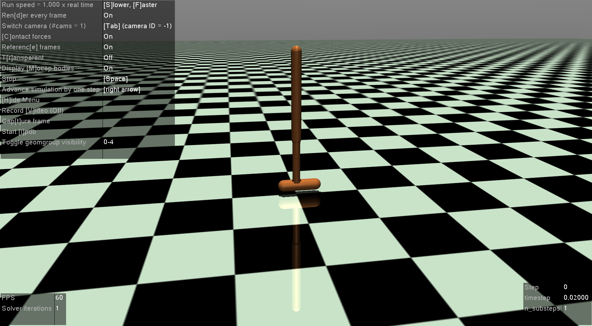

# Hoppingbot
Implementation of Guided Policy Search (GPS) on Hopping Bot.

# Unstable
This repo has been public for educational purposes and contribution are welcomed. I have stopped working on this
due to some ethical reasons in my previous work place, but if someone else wants to take this up and wants to 
collabarate with me, you are more than welcomed. Below have I provided a glimpse of all the TODO tasks. 
Idea and majoritiy of work was envisioned and done by me (even building this Readme.md file, for which I was not given any credits for my contribution :cry: ). 

It goes without saying that I would like to offer my thanks (even though that is insignificant) to Chelesa Finn (professor at Stanford) and S. Levine (professor at UC Berkley) (of course many others who contributed in developing this) for making their code an open source and making their work on GPS public. I would like offer my thanks for their generous contribution to the field of Reinforcement Learning. 

This code is unstable and needs lots of polishing. Many parts of the code are still under development. Currently,
I am working out the math required and re-deriving all the important equations of the GPS (please refer to S. Levine thesis on learning motor skills).

# Cite
Following people must be cited for their online/open source work [iLQR](https://github.com/anassinator/ilqr), [GPS](http://rll.berkeley.edu/gps/), [OpenAI](https://github.com/openai). Also commerical softwares like [MUJOCO](http://www.mujoco.org/). 

Most of the code was written by taking inspiration from the original publishers but I have added my flavour. I have trimmed code for our purposes or I have added other functionalities. Please cite me if you are using this repository: `Author: Sameer Kumar; Date: May 17th 2019; Title: GPS on Hopping task; Designation and School: Phd student in Texas A&M`. That date corresponds to when I made this code public. Also for contact information you can refer to my [website](https://sites.google.com/view/bvsk35/home?authuser=0).  

# How to Install
- Update: `sudo apt-get update`
- Jupyter Notebook: Run `python3 -m pip install --upgrade pip` and then `python3 -m pip install jupyter`
- Required Dependencies: Run `pip3 install -r requirement.txt`
- Scikit-Learn: `pip3 install -U scikit-learn`
- iLQR module: Go to ilqr-master_new and run `python3 setup.py install`
- GPU Drivers: To install drivers for Nvidia which are needed for running GPU follow the instructions in the following [link](https://www.tensorflow.org/install/gpu). Check if drivers are connected and they are responding by running `nvidia-smi`. This may give lot troubles hence be **patient** but this is the most *hardest* part of installation, after this is done you are all set. If you can't install **tensorflow-gpu** then just use **tensorlfow** (cpu version), it should be **fine**. To install tensorflow (cpu) remove the tensorflow-gpu which should have been installed by `requirement.txt`. For this run `pip3 uninstall tensorflow-gpu` and then run `pip3 install tensorflow`. 
- MUJOCO: To install go to following [link](http://www.mujoco.org/). There you can install student license version of this software. This may take time please by patient, but should be easier than above.
- Update and reboot (not necessary but recommened): `sudo apt-get update && sudo reboot`.
- Finally run `TrajGenerator-V2.ipynb`

# Information regarding Hopper:

- Bodies: Torso, Thigh, Leg, Foot (kinematic chain in order as per xml file)
- Torso: X: Slider, Y: Hinge, Z: Slider i.e, we have only linear movement in X, Z direction. 
  And we have rotation in Y direction.
- Thigh: Hinge joint in Y axis. Angle limit [-150, 0] degrees, Fricition 0.9.
- Leg: Hinge joint in Y axis. Angle limit [-150, 0] degrees, Fricition 0.9.
- Foot: Hinge joint in Y axis. Angle limit [-150, 0] degrees, Fricition 2.0.
- States: X = [ZPos, XPos, YPos, YDeg, YDeg, YDeg] in the order of kinematic links. 
  Velocities will also be in the same order.

# Files to add:
- [ ] Algorithm_BADMM.py
- [ ] Trajectory_Opt_LQR.py
- [ ] Algoithm.py
- [ ] Hyperparams.py
- [ ] Agent.py
- [ ] Agent_Utils.py
- [ ] Sample.py
- [ ] Sample_List.py
- [x] Agent_Config.py
- [x] Cost_Sum.py
- [x] Cost_State.py
- [x] Cost_Action.py
- [x] Cost_Utils.py
- [x] Config_ALG_BADMM.py
- [x] Config_Traj_Opt.py
- [x] Algorithm_Utils.py
- [x] Traj_Opt_Utils.py
- [x] Linear_Gauss_Policy.py
- [x] GPS_General_Utils.py
- [x] Policy.py
- [x] GMM.py

# TODO:
- [x] Add fully working `GMM.py`. 
- [x] Test MUJOCO Cart Pole and write function to extract states, send control and to control rendering. 
- [x] Figure out what does the following function do `class BundleType`.
- [x] Figure out what does the following function do `func extract_condition`.
- [x] Add function to calculate nominal trajectories using state dynamic matrices given by GMM.
- [x] Install TensorFlow GPU in both Python 2 and Python 3.
- [x] Install MUJOCO on PC. 
- [x] In GitHub add result folder and simulator results.
- [x] Write `Agent.py` files.
- [x] Recheck the files required for Trajectory Optimization.
- [x] Add function to calculate the nominal trajectory (i.e. iLQR optimized) using state dynamic matrices given by GMM. 
- [x] Read more about Agent.py file. What is the function of this file? Where it is called?
- [ ] Write the `Cost.py` files. Look how cost functions are written and how they are generalized?
- [ ] Write `Hyperparameter.py` files. 
- [ ] Understand how `Traj_Opt_Utils.py` computes KL-Divergence.
- [ ] Do we need noise patterns in the `LinearGaussianPolicy.py` file?
- [ ] Figure out what is Policy GMM and why are they are using it? Where does the code for Policy go? Where it is called?
- [ ] Figure out what these files do: `gps.py` (main file).
- [ ] Figure out what these files do: `PolicyOptCaffe.py` (then modify it into tensorflow based policy).
- [ ] Figure out what these files do: `gps.gui.config.py` (Rendering plus GUI can we make our code without using this?).
- [ ] Figure out what these files do: `gps.proto.gps_pb2.py` (can we make our code without using this?).
- [ ] Add information regarding CartPole simulator in Readme file. 

